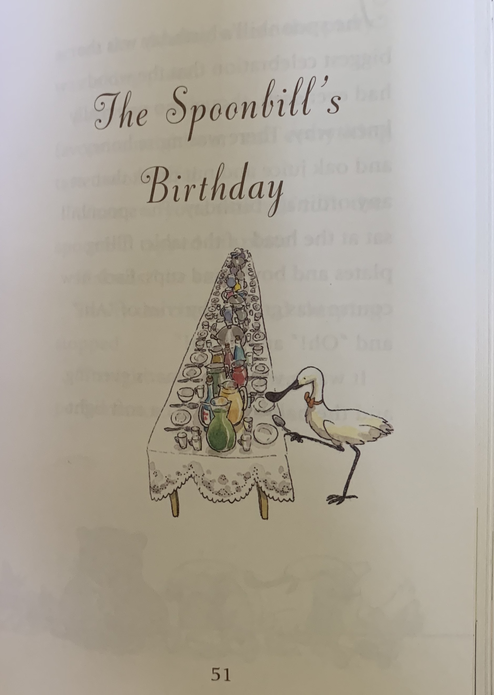

# A Childrens story reamagined

# Introduction 
I have chosen to adapt a children's story.  The author is Toon Telligan, a Dutch writer who was most popular in the 1960s.  I choose a text media to adapt because I believe in the value of text media.  The value to define culture and to leave behind our ideals and values for future generations. The story I am adapting is Squirrel's birthday.  It is one of my daughter's favorite stories. All of the characters use him/his/he pronouns.  If this book were an anomonly in its over representation of his/him/he pronouns I wouldn't feel the need to adapt the book to include her/she/ pronouns but the sad fact is that it is not uncommon to read a number of childrens books without finding a meaningul her/she character.  Because of that narrative when reading to my daughter I often change the pronouns to allow for her/she characters.  
So often books for young readers characters are animals with human characteristics which allows for an easy adaption of pronouns.  This also allows for the disperity for the disparities in racial diversity of the characters of these books (Thomas, Ebony Elizabeth 2016). In this adaptation there is no need to change a characters appearance to fit the gender norms of society. The only things I'll change are the pronouns, however the embued characteritistcs of these characters will shift.  What are female traits?  Is the character acting in a way that seems counterintuitve to their gender? Hopefully this will force adult reader to think of their own gender bias and question the way that represent the world especially to children through written word.

# 

Toon Telligan has four children's books that are made of collections of short stories. The stories are whimsical and usually feature a squirrel and an elephant.  The stories often have philosophical lessons and all the characters in the stories use him/his/he pronouns.  In five-year-old speak " They are ALL boys! That's not fair!" The majority of children's books feature a male protagonist.  Usually if there are more than three or four characters one of the lesser characters is female, however, that isn't the case in this series. Therefore I've chosen to remaster it with equal representation of hers and his pronouns.  
The reason I've choosen to use pronouns of his and her is because I want to show the characters representative to the time the author wrote this story. Specially I want to draw attention to the how unusual it is to write a story for a child, a girl child.  Toon Telligan wrote these stories for his granddaughter. To write a story with no female characters.  This choice is deliberate even if unconcious.  The world Toon Telligan lived in was most likely equally filled with people who used his/her pronouns however he choose to omit her pronouns almost entirely in his stories, even though they were directed towards a person who most likely identified as her/she.  

# Historical Context  

This story was written in 1995.  By Toon Telligan a General Practitioner of Medicine in Amsterdam.  Gender representation in novels at the time and currently tends to be male-dominated.  Typically men are in positions of power in publishing houses and publish men's novels, articles, journals and books with much more frequency than women.  Typically with the argument that women are weak writers. Women are more successful in getting children's, homemaking and romance novels published, as these are often considered women's work. This is impacted by editors and publishers. Therefore the representation available in children's book has suffered.  The majority of the characters are his/he/him pronouns, even though the characters are animals. This belies the everpresent role of male dominace in media.  Althogh women are often visual represented in media the way that women are protrayed is male centered.  Not through their own creation, but through the ideals imposed from a male dominated society.  Women are often shown as superficial and pretty without the active roles that men lead in media.  The rescuer, persuer, builder, maker etc.  These roles are reserved for men, with passive roles available to women.  This informs the way that we write, how we embue our characters.  Toon Telligan is also writing characters with a philosphical conception. Further creating a gender gap as Philosphy has fostered no heavily lauded females within its ranks.

# Before The Adaptation

# 

# [The Adaptation ]

I've chosen to adapt one of Toon Telligans more popular works.  The spoonbilles birthday, from the Far away and across the sea series.  I choose this work because its one of my daughter's favorites stories and it is a fun story to read aloud.  It's silly and unexpected, and the characters behaver in unexpected ways as Toon Telligan often used his childrens stories to formulate philosphocial concepts. So often children's books avoid "bad" behavior, as though mentioning it encourages it.  The sppnbills birthday is unique in that bad behavior is at the center of the story. As it as the center of human existance.  Humans behave badly, some more often and greivously than others. Toon Telligan manages to portray that bad behavior without menace or judgement. The spoonbills birthday  is different from Toon Telligans other works in that there is a large cast of characters.  Toon Telligans stories often feature 2 or 3 characters.  While the spoonbills birthday feautures 11 characters.  Which allows us more room to freedly adapt the pronouns of the characters.
### Formal Qualities 
Toon Telligans stories are popular not just for the text but also because of the illustrations. The illustrations seem to rest lightly on the page against a thick paper background.  They are grouped together at the bottom of the page for the first two pages and placed sporadically therafter. The colors are bright and warm and there are varying images throughout to counterbalance the text and other images. 

### Cultural Meaning 
As we acknowledge as a society the role that gender plays in determining economic, social and cultural significance within our society we began to move toward a more representational society.  Half of the people in the world give or take a few hundred thousand are women. Yet over 80% of novels, books, journals, and articles are published by men.  In order to effect immediate change children's literature endeavors to be equally representative.  As we see more articles, novels, and books being published by women we should also look back and ask.  What if some of our favorite stories were adapted with a goal of gender inclusion? There are stories we remember from our childhoods that form our identities.  What if our identities were formed with women and girls in mind? Who would we be? Who would our women and girls be? 

As we acknowledge as a society the role that gender plays in determining economic, social and cultural significance within our society we began to move toward a more representational society.  Half of the people in the world give or take a few hundred thousand are women. Yet over 80% of novels, books, journals, and articles are published by men.  In order to effect immediate change children's literature endeavors to be equally representative.  As we see more articles, novels, and books being published by women we should also look back and ask.  What if some of our favorite stories were adapted with a goal of gender inclusion? There are stories we remember from our childhoods that form our identities.  What if our identities were formed with women and girls in mind? Who would we be? Who would our women and girls be? 

# Rhetorical Significance  
I argue that women and girls would be more complete versions of themselves if technology affirmed their contributions to society.  Representation allows a role to be imagined. Allows someone to see themself there, participating and acknowledged.  As humans build our identities we imagine who we will become and a large part of that imagining is through mirroring.  Mirroring what you see and hear others do. When girls are constantly left out of the narrative their assumption is that they aren't a part of the narrative.  Their contributions are somehow unimportant or inferior. The average popular childrens books have an 11:1 his/her ratio( Weifler 1972).  Girls are underrepresented in print media and when girls are represented in print they follow, instead of lead.  Girls are not the central characters.  Even when the stories are written by women.  As we strive toward gender inclsivity we have to address our bias.  When asked why their aren't more girl characters the response is often that girl characters are more heavily scrutinzed and judged. That girl characters as lead protoganist are deemed unblievable and are unpopular by both genders. Would the Harry Potter series have been as popular with Hermoine as the protoganist?  Would the book have been published to as great a degree of success if Hermoine were the protoganist?  In order to change the roles available to girls we need to help girls imagine themselves in those roles, succedding and being recognized. If tht means we sit in our uncomforable, this just doesn't feel right place for a few years I'm all for it.

# Reflection 

I intend to work on furthering this project into a journal article.  I will take this adaptation as an example of how much impact can be made with so little change. How the integrity of the work remains while including women and girls as participants in society through this story.
