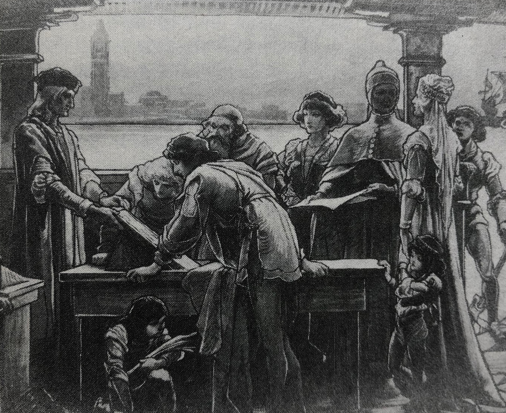
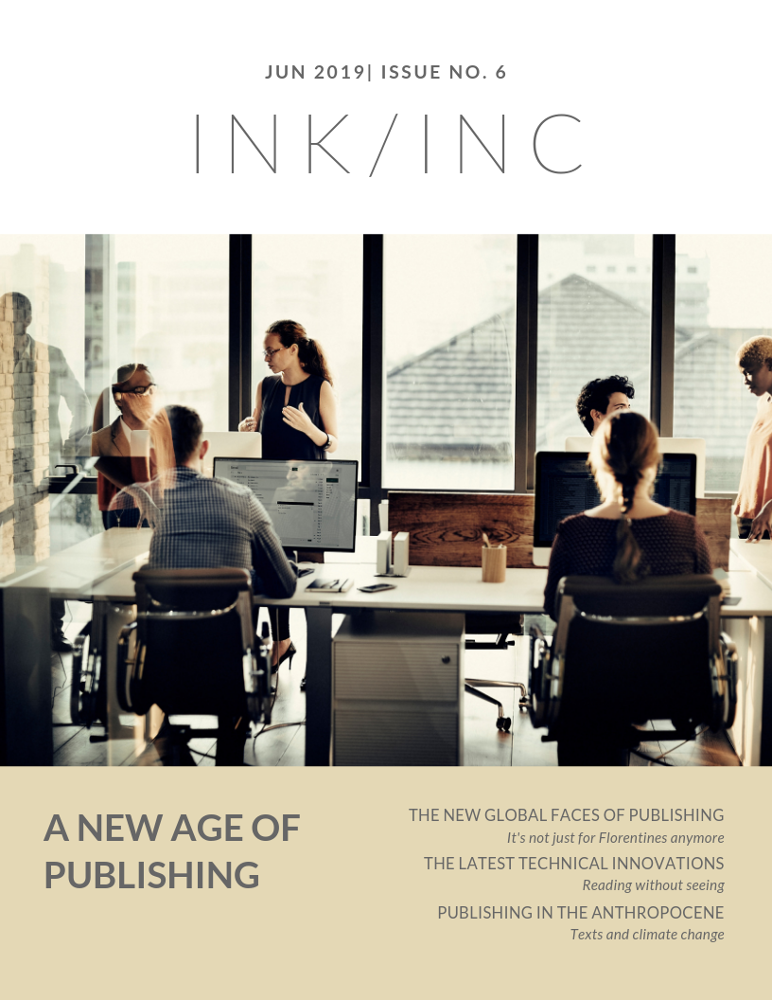

# Introduction (200-300 words)
Throughout this essay, I'm using markdown language instead of HTML to make headers, manipulate texts, and add images. Go to [this GitHub link](https://github.com/adam-p/markdown-here/wiki/Markdown-Cheatsheet) for help with markdown (md) language.

Here, I'm going to talk a little about the purpose of this site. If you're not sure **why** you're doing this project, be sure to read the **Context and Purpose** section of the prompt for this assignment. 

By discussing the purpose of this site (showcasing your artifact), it might be a good to **briefly** state the purpose of your adaptation and its intended audience. You could certainly have individual sections devoted to each of these, and chances are, you'll come back to purpose and audience when you discuss the "outcomes," "rhetorical significance," or "impact" towards the end. 

# Why Aldus Manutius? (150-250 words)
These section headings, like the one above, will help you organize your essay. Feel free to borrow headings from this model or make variations based on them.

Here, I'm going answer why I've selected this particular print for my project. Of course, for you, it could be any image, material, written text, or anything under the heading of "text technologies." Whatever you adapt is up to you. What's really important though is **why** you're adapting it. This might also be a good place to include an image or a sample of the text you're adapting. See mine below. 

The image you see above is right out of Howard's book. It's not really available for free online. To avoid copyright infringement, I've cropped quite a bit of it (plus we're not selling this image and we're using it for educational purposes, so it should be fine). If you can't find an image online or you need to use an image of your own making, the easiest thing to do is to upload it as a file to your repository. Then use the following to include your image: exclamation mark, brackets including the name of your image, followed by parentheses including the URL or just the file name, e.g. file.JPG. So it will look like this: ! [image name] (name.JPG) but with no spaces in between. 

# Historical Context (200-300 words) 

In this section, I'm writing about Manutius (perhaps a very short bio) and the European context in which he was working. Most likely, I'll have several quotes from Howard, and I might even use the Seattle University library to find an additional article about him. Because this is going to be a public document, I'll avoid non-scholarly sources like Wikipedia. Although, Wikipedia can be a great place to find articles (see the References section of any entry). 

Make sure that when you cite soureces, like Nicole Howard, if you use the author's name in the sentence--like I've done here--you won't need to include their name in the parentheses where you supply the page number for your quote or paraphrase (61). 

Also, you only need to call your authors by their full name the first time. After that, you can just refer to authors, like Howard, by their last name only. 

>>Just trying a block quote here. A block quote, generally, is a quote that includes five lines or more. So let's make one. Blah blah blah. Blah blah blah. Blah blah blah. Blah blah blah. Blah blah blah. Blah blah blah. Blah blah blah. Blah blah blah. Blah blah blah. Blah blah blah. Blah blah blah. Blah blah blah. Blah blah blah. Blah blah blah. Okay, so that's basically the size of a block quote. You can make it stand apart from the rest of your text in markdown by starting with two "greater than" characters (>>), followed by your text. 

# The Adaptation (150-250 words)

Here, I'm going to spend some time walking the audience through my adaptation. It might be wise to describe the kind of adaptation it is: **transposition, commentary, or analogue**. Think about all the analyses you've conducted this term. Most of them have been split in half. You've looked at the **formal qualities** as well as the **cultural significance** of these texts. I'm going to use an h2 (##) headings to divide this section into the two smaller subsections. 

This is also a good place to reveal your adaptation. Remember the quality of your adaptation, or let's say the "craftsmanship," is less important to us than your analysis. Think back to the sketches you made during the first week. Some of you used pencil and notebook paper. That could work here as well. Obviously, the more time and thought you put into it the better. I highly recommend that you use Canva, like I have below. Because I am at the mercy of what Canva has to offer, I may not end up with an image like the one I have in my head. That's fine. You can use this section to describe how your ideal version would be different, while the visual aid can just give us a "sense" of what you have in mind. For the same reason, please do not hesitate to upload handmade drafts or illustrations. In fact, I encourage it. 

### Formal Qualities (200-300 words) 

I might consider the grid of my image, the layout, hierarchy, or even the typeface. Go back through your Slack posts and select the formal aspects of the image that you deem to be most important. I would select at least 2-3 formal qualities. It might be helpful to compare and contrast your adaptation to the original. 

### Cultural Meaning (200-300 words) 

In this section, I'm going to investigate the cultural implications of my adaptation. You might want to select a particular theorist that helps you interpret your own artifact and/or process (e.g. Foucault, Barthes, Bourdieu, Stuart Hall, De Certeau, or someone else). It's really important that you engage with key words for the text/author you choose, define that term, and use it to inform a more well-rounded cultural analysis of your own adaptation. 

# Rhetorical Significance (200-300 words) 

In short, this is a good place to examine in depth who your adaptation addresses, what it will persuade them of, and the consequence of that persuasion, i.e. your outcomes. To aid you, this might be a good place to revisit some theorists that discussed how texts subordinate audiences to mere consumers (Debord) and those who thought texts can be imancipatory or liberating (Zizek). 

# Reflection (150-250 words) 

Consider concluding with a final reflection about your process and decision making. Try answering one or more of the following questions. 

1. If someone outside this class (like your intended audience) acutally viewed your artifact, what might they think of you (the artist). Avoid answers like, "I'm a good student!" and instead, think about how your art object is a reflection of your character. 

2. If you had abundant time and resources, what would you do differently for your adaptation? 

3. In what situation outside of class/school might this project might be applicable and how so? 

